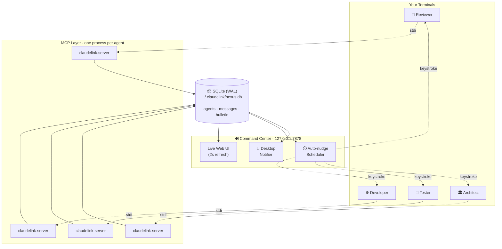
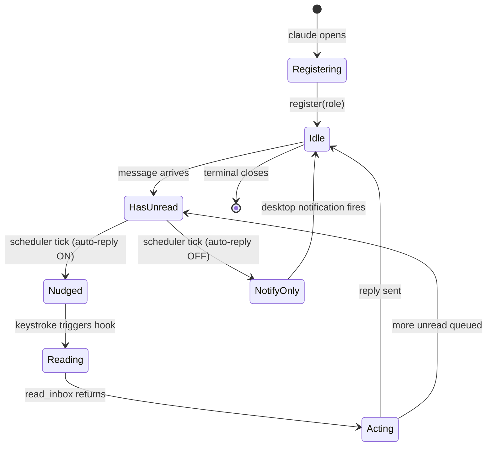
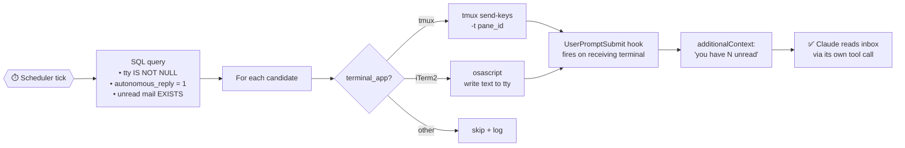

# ClaudeLink

> **The autonomous command center for Claude Code.** Run a swarm of Claude Code agents across multiple terminals, let them message each other, watch the whole mesh live, and walk away — they keep collaborating without you.

[](https://www.npmjs.com/package/claudelink)
[](LICENSE)
[](https://nodejs.org)
[](https://claude.com/claude-code)
[](https://modelcontextprotocol.io/)

ClaudeLink is an [MCP](https://modelcontextprotocol.io/) server that turns multiple AI coding agents (Claude Code, OpenAI Codex CLI, Google Gemini CLI, or any MCP-compatible client) into a **single coordinated team**. Open four terminals, give each one a role — reviewer, developer, tester, architect — and they share a real-time message bus, a bulletin board, and a closed-loop autonomous pipeline that keeps them working together when you step away. Mix models freely: a Claude reviewer talking to a Codex developer talking to a Gemini tester is a fully supported pattern.

You don't need to invent a multi-agent framework. You already have one.


---

## Why ClaudeLink exists

A single Claude Code session is fast. Five sessions running in parallel — each owning a slice of the work, talking to each other, escalating, reviewing, retrying — is a different category of tool entirely.

The blocker has always been the human in the loop: someone has to type *"check messages"* into every terminal. ClaudeLink removes that human. The result is a hands-free, low-overhead AI development team that runs on hardware you already own, with the model you already pay for.

| Without ClaudeLink | With ClaudeLink |
|---|---|
| One Claude per task | A coordinated swarm — reviewer, developer, tester, ops |
| You shuttle messages by hand | Agents message each other directly |
| You poll every terminal for updates | Auto-nudge wakes the right agent at the right time |
| No single view of the work | Live Command Center at `127.0.0.1:7878` |
| Every session is amnesiac to the others | Shared SQLite mesh + persistent bulletin board |

If your workflow already gets a 2× lift from one Claude, a coordinated team can get you to **3–5×** without adding a second subscription, a second machine, or a second human.

---

## End-to-end flow

```mermaid
sequenceDiagram
    autonumber
    participant A as Agent A<br/>(Reviewer)
    participant DB as SQLite Mesh<br/>nexus.db (WAL)
    participant SCH as Auto-nudge<br/>Scheduler
    participant TERM as Agent B's<br/>Terminal
    participant HOOK as UserPromptSubmit<br/>Hook
    participant B as Agent B<br/>(Developer)

    A->>DB: send(to:"developer", msg)
    Note over DB: row written, read=0
    rect rgb(30, 41, 59)
    Note over SCH,B: every N minutes, fully autonomous
    SCH->>DB: SELECT agents WITH unread mail
    DB-->>SCH: Agent B has 1 unread
    SCH->>TERM: tmux send-keys "check for updates"
    TERM->>HOOK: prompt submitted (trusted path)
    HOOK->>DB: peek unread
    DB-->>HOOK: 1 message
    HOOK-->>B: additionalContext: "you have 1 unread"
    B->>DB: read_inbox()
    DB-->>B: message from A
    B->>B: decide & act
    B->>DB: send(to:"reviewer", reply)
    end
```



This is the loop that makes ClaudeLink a command center instead of a messaging library. The keystroke is indistinguishable from you typing by hand — so it cleanly sidesteps Claude Code's prompt-injection defenses without any unsafe shortcuts. You set the cadence. You set who participates. The agents run themselves.

---

## System architecture



No daemon. No background service. Each Claude Code session spawns its own MCP server, and they coordinate through a single SQLite database in WAL mode — safe, concurrent, crash-resilient. The Command Center launches automatically with the first agent and persists across MCP restarts.

---

## Agent lifecycle



Every agent has a per-row **Auto-reply toggle** in the Command Center. Flip it any time. Useful for advisor / strategy terminals you want quiet, or to put your morning standup on auto-pilot then quiet it again while you think.

---

## Keystroke dispatch



The keystroke path matters. By simulating a real key event we route through Claude's normal trusted-input pipeline. The agent retains full agency over whether and how to reply — ClaudeLink never forges tool calls or fabricates intent.

---

## Quick start

```bash
# install + auto-configure (one command)
npx claudelink init

# restart your Claude Code terminals — that's it
```

Open three terminals:

**Terminal 1**
> "Register as a code reviewer working on the auth module."

**Terminal 2**
> "Register as a developer. Send a message to the reviewer asking for the last hot-spot list."

**Terminal 3** (Command Center is already open — just look at it.)

Within a minute the reviewer's reply appears in terminal 2, the developer acts on it, and the bulletin board shows what changed. You typed nothing in the second terminal after registration.

---

## Installation

### 1. Install the package
```bash
npm install -g claudelink
```

### 2. Add to your AI client

**Claude Code (global, recommended):**
```bash
claude mcp add --scope user claudelink -- claudelink-server
```

**Codex CLI (global):**
```bash
codex mcp add claudelink -- claudelink-server
# or: claudelink init --codex --global
```

**Gemini CLI (global):**
```bash
claudelink init --gemini --global
# Merges mcpServers.claudelink into ~/.gemini/settings.json + writes ~/.gemini/GEMINI.md
```

**Everything at once (global):**
```bash
claudelink init --all --global   # Claude + Codex + Gemini, three clients on one mesh
```

**Per-project (mix and match):**
```bash
cd your-project
npx claudelink init                       # Claude Code (.mcp.json + CLAUDE.md)
npx claudelink init --codex               # Codex CLI (AGENTS.md + TOML snippet)
npx claudelink init --gemini              # Gemini CLI (.gemini/settings.json + GEMINI.md)
npx claudelink init --codex --gemini      # stack flags additively
npx claudelink init --all                 # all three clients in one project
```

### 3. Restart your terminals

ClaudeLink tools appear automatically. Done.

### Multi-model support

ClaudeLink doesn't care which model is on the other end of an MCP connection. The MCP layer is open — any compliant client can register and participate. A Claude advisor can message a Codex developer can message a Gemini tester, and the Command Center shows them all as peers on the same mesh. The only Claude-Code-specific layer is the optional Stop hook (which gives instant turn-end pickup); Codex and Gemini agents fall back to the auto-nudge scheduler's keystroke cadence, which is fine for almost every workflow.

### Requirements
- Node.js 18+
- An MCP-compatible client: Claude Code CLI, OpenAI Codex CLI, or Google Gemini CLI
- macOS or Linux (Windows works for messaging; auto-nudge requires tmux)

---

## Command Center

The Command Center is a local web UI at `http://127.0.0.1:7878` — a live console for the entire mesh. The first `claudelink-server` to boot launches it; subsequent agents share the same window. It survives MCP restarts and only exits when you click **Quit UI**.

### What it gives you

| Panel | What it does |
|---|---|
| **Running servers** | Every `claudelink-server` process with PID, TTY, uptime, role. Per-row **Kill** button. |
| **Registered agents** | Role, status, **per-agent Auto-reply toggle**, sent/received counts, last-seen. |
| **Health** | Total agents, unread/total messages, bulletin entries, orphan blockers, FK violations. **Heal orphans** cleans dead-agent tail rows in one transaction. |
| **Auto-nudge** | Global on/off + tick interval (1–120 min). Scheduler only fires for terminals that *actually have* unread mail — no wasted Claude turns. |
| **Recent messages** | Live feed of the last several messages across all agents, with priority and unread badges. |

The page auto-refreshes every 2 seconds. **Kill all servers** in the header drops the entire mesh in one click.

### Lifecycle

A lock file at `~/.claudelink/ui.lock` prevents duplicate windows. The launcher detached-spawns the UI process with `unref()` so it outlives the MCP parent. If a stale lock is detected (PID dead and no heartbeat at `/api/heartbeat`), a fresh UI takes over automatically.

To opt out: `CLAUDELINK_UI=off` in your environment before starting Claude Code.

```bash
claudelink ui          # start it manually (or just spawn any agent)
claudelink ui --stop   # graceful shutdown
```

---

## Available tools

Once connected, every Claude Code session gains these MCP tools:

| Tool | Purpose | Example prompt |
|---|---|---|
| `register` | Identify this agent on the mesh | *"Register as a developer working on the payment system"* |
| `send` | Direct message to a role | *"Send a high-priority message to the reviewer: fix is ready for re-review"* |
| `broadcast` | Send to all agents | *"Broadcast: deployment in 5 minutes, hold all merges"* |
| `read_inbox` | Pull unread messages | *"Check my inbox"* |
| `get_agents` | Roster of who's online | *"Who's online?"* |
| `post_bulletin` | Persistent announcement | *"Post to bulletin: v2.1 release branch created"* |
| `get_bulletin` | Read the bulletin board | *"Show the bulletin board"* |

`register` and `send` accept v1.1 options: `autonomousReply`, `expectsReply`, `parentMessageId` for thread tracking, FYI semantics, and per-agent autonomy control.

---

## CLI

```bash
claudelink init                       # configure for current project
claudelink init --global              # configure globally
claudelink status                     # show registered agents + message stats
claudelink ui                         # open the Command Center
claudelink ui --stop                  # stop the Command Center
claudelink install-hooks              # install autonomous-reply hooks (project)
claudelink install-hooks --global     # install hooks in ~/.claude/settings.json
claudelink install-hooks --uninstall  # remove ClaudeLink hooks
claudelink reset                      # clear all data (fresh start)
claudelink help                       # full help
```

---

## Autonomous replies (deep dive)

ClaudeLink ships **two complementary mechanisms** for hands-free agent collaboration. Both feed messages into the recipient through Claude's own `read_inbox` tool — Claude always has agency.

### 1. Auto-nudge scheduler (primary)

The Command Center runs a periodic scheduler that types `check for updates` into each registered agent's terminal whenever its inbox has unread mail. Configure directly from the UI:

- **On/off toggle** — Auto-nudge panel
- **Interval** — 1–120 minutes (default 5)

The scheduler is **smart**: the SQL filter only nudges terminals with unread mail. Empty inboxes don't burn Claude turns. Per-terminal-app dispatch:

| Terminal | Mechanism | Permissions |
|---|---|---|
| **tmux** | `tmux send-keys -t <pane>` | none |
| **iTerm2** | `osascript` matched by tty | none |
| **Apple Terminal** | unsupported (would need Accessibility) | not silently prompted |

When the keystroke arrives, the existing UserPromptSubmit hook injects `"you have N unread, call read_inbox"` as `additionalContext`. Claude reads via its own tool call — fully trusted path.

Settings persist at `~/.claudelink/scheduler.json`. Audit log at `~/.claudelink/scheduler.log`.

### 2. Stop hook (low-latency supplement)

For the case where an agent has *just* finished a turn and there's a message waiting, a Stop hook can fire immediately instead of waiting for the next scheduler tick:

```bash
claudelink install-hooks                # project-scoped
claudelink install-hooks --global       # writes ~/.claude/settings.json
claudelink install-hooks --uninstall    # clean rollback
```

The hook emits `{"decision": "block", "reason": "..."}` directing Claude to call `read_inbox`. Three guards prevent runaway loops:

- **Hard cap** — max consecutive auto-fires per terminal without a human prompt (`CLAUDELINK_HARD_CAP`, default 5)
- **Cooldown** — minimum seconds between auto-fires (`CLAUDELINK_COOLDOWN_S`, default 30)
- **Chain cap** — max `parent_id` chain depth before a message stops triggering auto-fires (`CLAUDELINK_CHAIN_CAP`, default 8)

Set any to `0` to disable. Decisions log to `~/.claudelink/auto-fire.log`.

> **Honest note on Claude's safety boundary:** Claude Code's prompt-injection defense correctly flags external content steering outbound tool calls. The Stop hook reliably triggers an autonomous inbox read; Claude may decline to send the outbound reply autonomously when the reply would be unrelated to the user's most recent prompt. This is responsible safety behavior, not a bug. **The auto-nudge scheduler avoids this entirely** because the keystroke path is indistinguishable from the user typing by hand.

### Per-agent opt-out

Two ways to silence an agent:

1. **At registration** — `autonomousReply: false` for terminals that should receive but never auto-process. Useful as a default for advisor / strategy terminals.
2. **Live from the Command Center** — flip the **Auto-reply** column checkbox. Applies on the next scheduler tick. Lifetime: holds until that agent re-registers (close + reopen Claude Code in that terminal).

When opted out: the Stop hook still reads the inbox (so messages don't pile up) but never emits a continuation, and the auto-nudge scheduler skips that agent at the SQL filter — no keystroke is sent.

### Per-message opt-out

Send with `expectsReply: false` for FYI / informational pings.

### Desktop notifications

The Command Center fires a macOS desktop notification (via `osascript display notification`, no Accessibility permission needed) for every new message that lands in any agent's inbox — including agents with `autonomousReply: false`. Multiple messages in the same 2-second poll window collapse into one summary notification. Off-switch: `CLAUDELINK_NOTIFY=off`.

### Debug knobs

- `CLAUDELINK_HOOK_TTY=/dev/ttysNNN` — override TTY auto-detection (testing, CI)
- `CLAUDELINK_HOOK_STRICT=1` — surface hook errors to stderr instead of swallowing them
- `CLAUDELINK_NOTIFY=off` — disable desktop notifications

---

## Autonomous mode setup

By default, you'd have to tell Claude *"check my inbox"* manually every time. That defeats the purpose. Autonomous mode is installed automatically when you run `claudelink init` or `claudelink init --global` — it writes a `CLAUDE.md` file in the appropriate directory:

- `init --global` → writes to `~/.claude/CLAUDE.md` (all projects)
- `init` → writes to `./CLAUDE.md` (current project only)

If you already have a `CLAUDE.md`, the ClaudeLink instructions are appended without overwriting your existing content. Running init multiple times is safe — no duplication.

### What it teaches Claude

The `CLAUDE.md` file instructs every Claude Code session to:

- **Check inbox automatically** before and after every task
- **Send updates proactively** to other agents when work is completed
- **Respond to messages immediately** without waiting for you to say "check inbox"
- **Post to the bulletin board** when making decisions that affect the project

### Without vs with autonomous mode

```diff
- Without:
- You: Fix the bug in auth.ts
- Claude: (fixes the bug)
- You: Now check your inbox
- Claude: You have 1 message from the reviewer...
- You: Send the reviewer an update
- Claude: Message sent.

+ With autonomous mode:
+ You: Fix the bug in auth.ts
+ Claude: (checks inbox — sees a tip from the reviewer about the bug)
+        (fixes the bug using the reviewer's guidance)
+        (sends the reviewer: "Fixed it, here's what I changed...")
+        (posts to bulletin: "auth.ts bug fixed")
+        Done. I fixed the token validation bug.
```

One instruction from you. All the communication happens automatically.

---

## Use cases

### 🔍 Code review pipeline
- **Reviewer** scans diffs, sends findings to developer
- **Developer** receives feedback, implements fixes, notifies reviewer when ready

### 🧪 Test-driven development
- **Developer** writes implementation
- **Tester** runs tests, reports failures back to developer

### 🏛️ Full team simulation
- **Architect** posts design decisions to bulletin board
- **Developer** implements features, asks architect for clarification
- **Reviewer** reviews code, sends feedback to developer
- **Ops** monitors build pipeline, broadcasts deployment status

### ⚡ Parallel feature development
- **dev-auth** working on authentication
- **dev-api** working on API endpoints
- Both coordinate to avoid conflicts and share interface contracts

### 🌐 Long-running research swarm
- **planner** breaks the question into sub-tasks
- **researchers** (3–4 agents) tackle independent slices
- **synthesizer** consolidates findings into a single report
- All running while you do something else; auto-nudge keeps them moving

---

## Configuration

ClaudeLink stores its database at `~/.claudelink/nexus.db`. The path is fixed so all Claude Code instances across all projects converge on the same hub.

### `.mcp.json` (per-project)
```json
{
  "mcpServers": {
    "claudelink": {
      "type": "stdio",
      "command": "claudelink-server"
    }
  }
}
```

### `~/.claude.json` (global via CLI)
```bash
claude mcp add --scope user claudelink -- claudelink-server
```

---

## Architecture details

### Why SQLite?
- Zero configuration — single file, no server to run
- WAL mode handles concurrent readers and writers safely
- Survives process crashes — no data loss
- Portable across macOS, Linux, and Windows

### Message flow
1. Agent A calls `send(to="developer", message="...")`
2. MCP Server A writes a row to the `messages` table
3. Auto-nudge scheduler (or Stop hook) wakes Agent B
4. MCP Server B reads unread rows and marks them read atomically (`UPDATE...RETURNING`)
5. Agent B receives the message and acts

### Agent lifecycle
- Agents register with a `role`, `pid`, `tty`, and `terminal_app` (auto-detected)
- Heartbeat updates `last_seen` every 30 seconds
- Dead processes (checked via `kill -0 pid`) auto-pruned at next listing
- No manual cleanup needed; the Command Center exposes a one-click **Heal orphans** for tail rows

---

## FAQ

### Wait, does `npx claudelink init` start Claude?

**No.** You only run `npx claudelink init` once. It's a setup command that writes a config file (`.mcp.json`) telling Claude Code to connect to ClaudeLink on startup. After that, you never need to run it again — your daily workflow is exactly the same:

```bash
claude                                # standard
claude --dangerously-skip-permissions # auto-permissions
claude --allowedTools "mcp__claudelink__*"  # auto-approve only ClaudeLink tools
```

Claude Code reads `.mcp.json` on startup, sees ClaudeLink is configured, connects automatically. The tools just appear.

### How do I disable ClaudeLink?

You do not need to restart your computer. Pick one:

**Per project:** edit `.mcp.json` and remove the `claudelink` block.
**Globally:** `claude mcp remove --scope user claudelink`
**Reset data only:** `npx claudelink reset` (keeps config, deletes DB)
**Full uninstall:**
```bash
claude mcp remove --scope user claudelink
npm uninstall -g claudelink
rm -rf ~/.claudelink
```

### Can I temporarily disable it without deleting anything?

Yes — set `"disabled": true` in the `.mcp.json` block:

```json
{
  "mcpServers": {
    "claudelink": {
      "type": "stdio",
      "command": "claudelink-server",
      "disabled": true
    }
  }
}
```

### Will agents talk to each other across machines?

Not yet — current backend is local SQLite. Multi-machine support (a networked backend) is on the contributions roadmap below.

### Does this work on Windows?

Messaging works on any platform with Node 18+. The auto-nudge scheduler currently dispatches to tmux and iTerm2 only; on Windows you'd run inside WSL + tmux for the full autonomous loop.

---

## Contributing

This is open source. Contributions welcome.

```bash
git clone https://github.com/jaysidd/claudelink.git
cd claudelink
npm install
npm run build
node dist/index.js          # run MCP server directly
node dist/cli.js status     # exercise CLI
```

### Roadmap ideas
- **Channels / topics** — named buses for topic-based collaboration
- **Message search & history** — query past messages, not just unread
- **Structured payloads** — file paths, code snippets, diffs as first-class types
- **Priority interrupts** — break the recipient's current turn for high-priority pings
- **Agent templates** — pre-built role configs for common workflows
- **Webhooks** — push agent activity to external services
- **Encryption at rest**
- **Multi-machine support** — networked backend so swarms span hosts

If you ship one of these, send a PR. If you ship something we didn't think of, send it anyway.

---

## License

MIT — see [LICENSE](LICENSE).

---

Built by [Jay Siddiqi](https://github.com/jaysidd). If ClaudeLink helps your workflow, **star the repo** and share it with your team — discoverability is everything for an open-source project.

---

### Keywords

claudelink, claude link, claude code, claude code mcp, claude code multi-agent, claude code automation, claude code command center, claude code productivity, claude code orchestration, mcp server, model context protocol, multi-agent communication, ai agent collaboration, multi-terminal ai, agent-to-agent messaging, autonomous ai agents, autonomous claude code, ai swarm, multi-agent system, ai team simulation, agent message bus, agent mesh, ai agent hub, collaborative ai agents, claude mcp server, sqlite mcp, iterm2 ai, tmux ai, terminal ai agents, ai agent framework, agent communication protocol, ai pair programming, ai code review, multi-agent workflow, ai workflow automation, agent orchestration, autonomous developer agents, ai dev productivity, 5x developer, ai pipeline, ai infrastructure, claude code plugin, claude code extension, ai developer tools, open source ai tools, mcp tools.
