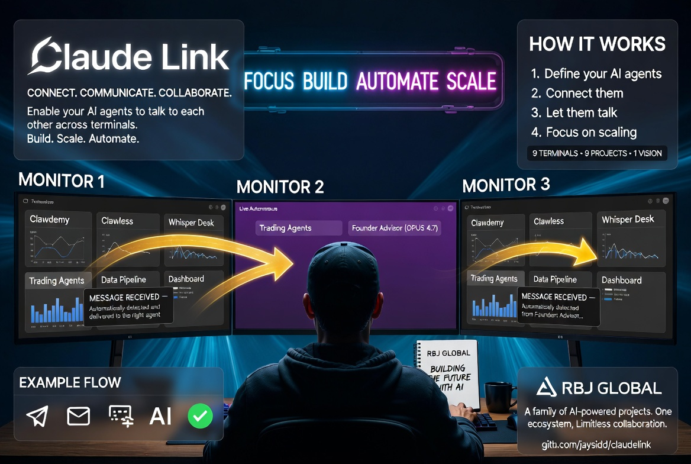
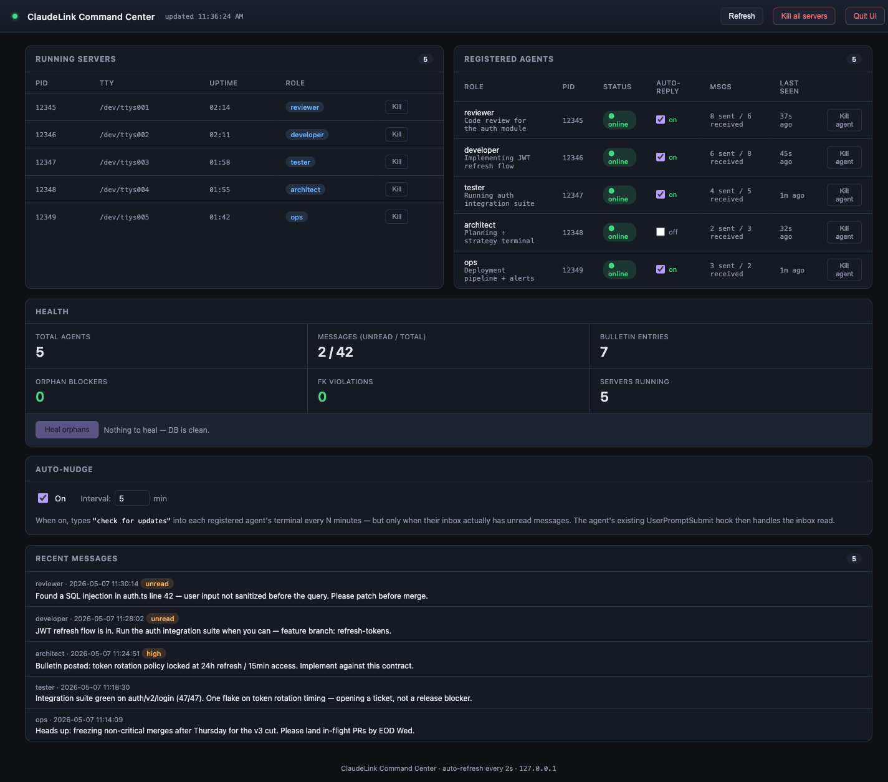
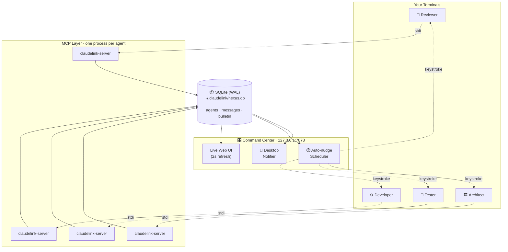
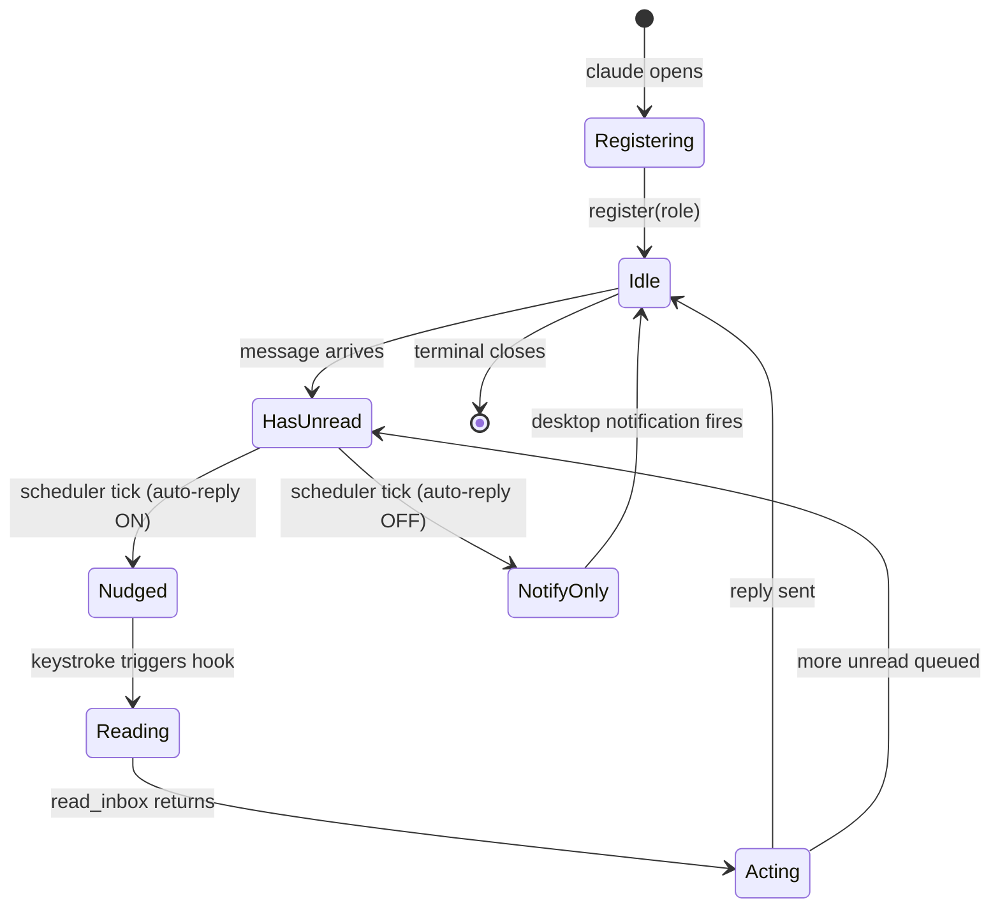
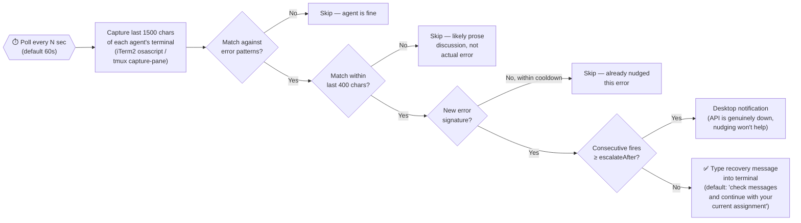
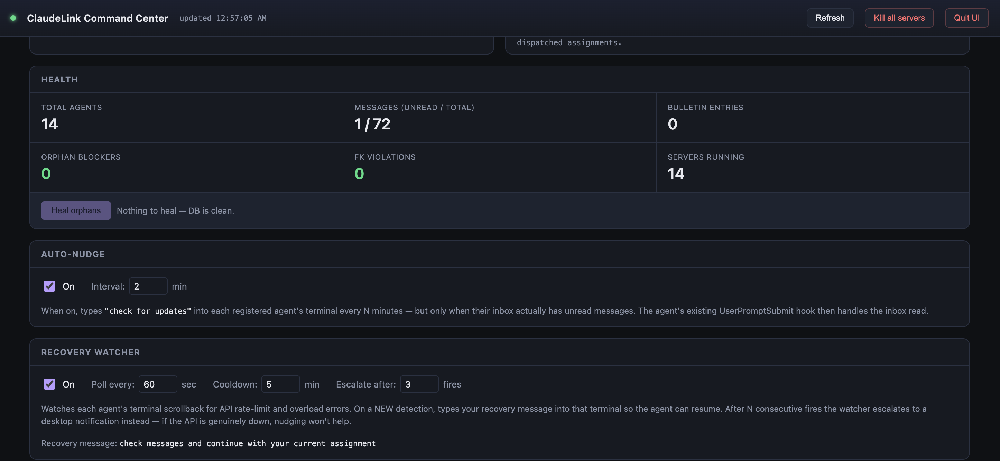

# ClaudeLink

> **The autonomous command center for AI coding agents — any model, any provider.** Run a swarm of Claude Code, Codex CLI, Gemini CLI, and Goose agents across multiple terminals, with the underlying LLM chosen freely from **hundreds of models** spanning Anthropic, OpenAI, Google, xAI, Mistral, OpenRouter, Ollama (local), Bedrock, Vertex AI, and more. They message each other, you watch the whole mesh live, and they keep collaborating when you walk away. **No cloud. No telemetry. No account.** It all runs on your machine.

[](https://www.npmjs.com/package/claudelink)
[](LICENSE)
[](https://nodejs.org)
[](#compatible-ai-clients)
[](https://modelcontextprotocol.io/)
[](#local-first-security)




ClaudeLink is an open-source [MCP](https://modelcontextprotocol.io/) server that turns multiple AI coding agents — Claude Code, OpenAI Codex CLI, Google Gemini CLI, Block's Goose, or any MCP-compatible client — into a **single coordinated team**. Open four terminals, give each one a role, and they share a real-time message bus, a bulletin board, and a closed-loop autonomous pipeline that keeps them working together when you step away.

**The name says "Claude" but ClaudeLink is model-agnostic.** Each CLI you plug in chooses its own backing model — and through Goose alone you can wire any of **25+ LLM providers**, putting hundreds of models within reach of the same mesh. A Claude reviewer talking to a Codex developer talking to a Gemini tester talking to a Llama-via-Ollama deep-thinker is a fully supported pattern. The mesh doesn't care; the LLM is somebody else's problem.

You don't need to invent a multi-agent framework. You already have one.



---

## Why ClaudeLink exists

A single AI coding agent is fast. Five agents running in parallel — each owning a slice of the work, talking to each other, escalating, reviewing, retrying — is a different category of tool entirely.

The blocker has always been the human in the loop: someone has to type *"check messages"* into every terminal. ClaudeLink removes that human. The result is a hands-free, low-overhead AI development team that runs on hardware you already own, with the agentic CLIs you already pay for.

| Without ClaudeLink | With ClaudeLink |
|---|---|
| One agent per task | A coordinated swarm — reviewer, developer, tester, ops |
| One model per task | Mix Claude, Codex, Gemini, Goose freely on the same mesh |
| You shuttle messages by hand | Agents message each other directly |
| You poll every terminal for updates | Auto-nudge wakes the right agent at the right time |
| No single view of the work | Live Command Center at `127.0.0.1:7878` |
| Every session is amnesiac to the others | Shared SQLite mesh + persistent bulletin board |

If one agent already gives you a 2× lift, a coordinated heterogeneous team can get you to **3–5×** without adding a second subscription you don't already own, a second machine, or a second human.

---

## Compatible AI clients

ClaudeLink works with any MCP-compatible coding CLI. Today, four are first-class with one-command install:

| CLI | Vendor | Models it can run | Install |
|---|---|---|---|
| **[Claude Code](https://claude.com/claude-code)** | Anthropic | Claude (Opus, Sonnet, Haiku) | `claudelink init --claude --global` |
| **[Codex CLI](https://developers.openai.com/codex/cli)** | OpenAI | GPT-5 family, GPT-4-class | `claudelink init --codex --global` |
| **[Gemini CLI](https://github.com/google-gemini/gemini-cli)** | Google | Gemini 2.5 Pro / Flash family | `claudelink init --gemini --global` |
| **[Goose](https://github.com/aaif-goose/goose)** | Block / AAIF | **25+ providers** — any model behind any of them (see below) | `claudelink init --goose --global` |

Or set up all four in one shot:

```bash
claudelink init --all --global
```

### Model reach (especially through Goose)

A single Goose terminal in your mesh can speak to whatever provider you point it at. That's a lot of models — from a single mesh:

- **Frontier providers**: Anthropic Claude, OpenAI GPT, Google Gemini, xAI Grok, Mistral
- **Cloud platforms**: AWS Bedrock, GCP Vertex AI, Azure OpenAI, Databricks, Snowflake
- **Aggregators**: [OpenRouter](https://openrouter.ai/) — hundreds of models from one API key
- **Local / offline**: [Ollama](https://ollama.com/), Ramalama, Docker Model Runner — thousands of open-weight model variants running on your hardware
- **Inference-only**: Groq for blazing-fast token rates

This means **ClaudeLink isn't really "Claude" anymore** — it's the coordination plane, and the model space below it is essentially open. Want a Llama-3 reviewer running locally via Ollama, a Claude Sonnet implementer for hard reasoning, and a Groq-powered Llama for fast scaffolding? Spin up three Goose terminals (or a Goose + a Claude Code + a Codex), hand each one its role, and they share the same SQLite mesh. Pick the model for the job, on a per-agent basis, with no ClaudeLink-side configuration.

> **What's the catch?** The auto-nudge layer that types `check for updates` into a terminal needs the CLI to be running in iTerm2 or tmux on macOS / Linux. Apple Terminal isn't supported (Accessibility permission we don't want to silently ask for). MCP messaging itself works regardless of terminal.

Beyond the four flagged CLIs, **any MCP-compatible client can join** — point its MCP config at `claudelink-server`, add a copy of the multi-agent instructions to its project-instructions file. Roll your own and want a `--<your-cli>` flag? Open a PR with the install path; it's roughly an hour of work to add one.

---

## Heterogeneous workflows

Why mix models? Because each one is good at different things, and ClaudeLink lets you put each on the task it shines at.

| Pattern | Recipe |
|---|---|
| **Reviewer + Developer + Tester** | Claude advises, Codex implements, Gemini stress-tests. The advisor catches what the implementer rationalizes; the tester catches what both miss. |
| **Cost-optimized swarm** | Use a faster, cheaper agent for boilerplate (Codex, Goose), reserve the bigger model (Claude Opus, Gemini 2.5) for the few terminals doing hard reasoning. |
| **Cross-checker** | Run two implementations of the same feature on two different agents, then have a third agent diff their outputs and flag inconsistencies. |
| **Audit / discovery** | Goose for system inspection, Claude for narrative summary, Codex for surfacing edge cases. They post their findings to the bulletin board and you read one consolidated thread. |

The Command Center shows them all as peers in the same mesh — agent role, sent/received counts, last-seen, auto-reply state. It doesn't matter which CLI is on the other end of an MCP connection.

---

## End-to-end flow

```mermaid
sequenceDiagram
    autonumber
    participant A as Agent A<br/>(Reviewer)
    participant DB as SQLite Mesh<br/>nexus.db (WAL)
    participant SCH as Auto-nudge<br/>Scheduler
    participant TERM as Agent B's<br/>Terminal
    participant HOOK as UserPromptSubmit<br/>Hook
    participant B as Agent B<br/>(Developer)

    A->>DB: send(to:"developer", msg)
    Note over DB: row written, read=0
    rect rgb(30, 41, 59)
    Note over SCH,B: every N minutes, fully autonomous
    SCH->>DB: SELECT agents WITH unread mail
    DB-->>SCH: Agent B has 1 unread
    SCH->>TERM: tmux send-keys "check for updates"
    TERM->>HOOK: prompt submitted (trusted path)
    HOOK->>DB: peek unread
    DB-->>HOOK: 1 message
    HOOK-->>B: additionalContext: "you have 1 unread"
    B->>DB: read_inbox()
    DB-->>B: message from A
    B->>B: decide & act
    B->>DB: send(to:"reviewer", reply)
    end
```



This is the loop that makes ClaudeLink a command center instead of a messaging library. The keystroke is indistinguishable from you typing by hand — so it cleanly sidesteps the prompt-injection defenses that Claude Code (and other safety-conscious CLIs) ship with, without any unsafe shortcuts. You set the cadence. You set who participates. The agents run themselves.

---

## System architecture



No daemon. No background service. Each agent session (Claude Code, Codex, Gemini, Goose) spawns its own short-lived `claudelink-server` MCP process, and they coordinate through a single SQLite database in WAL mode — safe, concurrent, crash-resilient. The Command Center launches automatically with the first agent and persists across MCP restarts.

---

## Agent lifecycle



Every agent has a per-row **Auto-reply toggle** in the Command Center. Flip it any time. Useful for advisor / strategy terminals you want quiet, or to put your morning standup on auto-pilot then quiet it again while you think.

---

## Keystroke dispatch


The keystroke path matters. By simulating a real key event we route through the agent's normal trusted-input pipeline. The agent retains full agency over whether and how to reply — ClaudeLink never forges tool calls or fabricates intent. This is *why* it works for Codex, Gemini, and Goose without modification: the keystroke is a primitive every CLI handles identically.

---

## Quick start

```bash
# install + auto-configure all four supported CLIs globally
npx claudelink init --all --global

# restart your terminals — that's it
```

Open three terminals — mix CLIs however you like:

**Terminal 1** (Claude Code, advisor)
> "Register as a code reviewer working on the auth module."

**Terminal 2** (Codex CLI, implementer)
> "Register me as a developer. Send a message to the reviewer asking for the last hot-spot list."

**Terminal 3** (Gemini CLI, validator) — or just leave the Command Center open.
> "Register me as a tester. Watch for completed work and run validation passes."

Within a minute the reviewer's reply lands in terminal 2, the developer acts on it, and the bulletin board shows what changed. You typed nothing in the second or third terminal after registration. The Command Center at `http://127.0.0.1:7878` shows all three peers in real time, regardless of which model is on the other end of each.

---

## Installation

### 1. Install the package
```bash
npm install -g claudelink
```

### 2. Add to your AI client

**Claude Code (global, recommended):**
```bash
claude mcp add --scope user claudelink -- claudelink-server
```

**Codex CLI (global):**
```bash
codex mcp add claudelink -- claudelink-server
# or: claudelink init --codex --global
```

**Gemini CLI (global):**
```bash
claudelink init --gemini --global
# Merges mcpServers.claudelink into ~/.gemini/settings.json + writes ~/.gemini/GEMINI.md
```

**Goose (global):**
```bash
claudelink init --goose --global
# Adds the claudelink extension to ~/.config/goose/config.yaml + writes ~/.config/goose/.goosehints
```

**Everything at once (global):**
```bash
claudelink init --all --global   # Claude + Codex + Gemini + Goose on one mesh
```

**Per-project (mix and match):**
```bash
cd your-project
npx claudelink init                       # Claude Code (.mcp.json + CLAUDE.md)
npx claudelink init --codex               # Codex CLI (AGENTS.md + TOML snippet)
npx claudelink init --gemini              # Gemini CLI (.gemini/settings.json + GEMINI.md)
npx claudelink init --goose               # Goose (.goosehints + config snippet)
npx claudelink init --codex --gemini      # stack flags additively
npx claudelink init --all                 # all four clients in one project
```

### 3. Restart your terminals

ClaudeLink tools appear automatically. Done.

### Multi-model support

ClaudeLink doesn't care which model is on the other end of an MCP connection. The MCP layer is open — any compliant client can register and participate. A Claude advisor can message a Codex developer can message a Gemini tester, and the Command Center shows them all as peers on the same mesh. The only Claude-Code-specific layer is the optional Stop hook (which gives instant turn-end pickup); Codex, Gemini, and Goose agents fall back to the auto-nudge scheduler's keystroke cadence, which is fine for almost every workflow.

### Local-first security

ClaudeLink is built to disappear into your dev environment, not become another SaaS dashboard you have to trust:

- **No cloud, no servers.** Every byte of state lives in `~/.claudelink/nexus.db` on your machine.
- **No telemetry, no analytics, no phone-home.** Read the source — there's nothing to opt out of because nothing is sent.
- **No account, no signup, no API key.** ClaudeLink doesn't talk to any external service. The agents talk to their own LLM providers however they normally would; ClaudeLink is just the connective tissue between *them*.
- **Loopback by default.** The Command Center binds to `127.0.0.1:7878`. It's not reachable from outside your machine unless you explicitly opt in (planned for the v1.2 multi-machine release with bearer-token auth on a LAN bind).
- **Fully open source.** MIT licensed. Every line of code is in this repo. Code is auditable, forkable, and you can run a custom build for your enterprise's compliance posture.
- **Sandboxed terminal interaction.** The auto-nudge scheduler types into iTerm2 / tmux through their public AppleScript / send-keys APIs — the same way a Bash script would. No accessibility shims, no kernel hooks, no permission prompts.

If you've been hesitant to wire AI agents together because every "multi-agent framework" wants you to send your context to their cloud, ClaudeLink is built for you. Your code stays where it is.

### Requirements
- Node.js 18+
- One or more MCP-compatible clients: Claude Code, OpenAI Codex CLI, Google Gemini CLI, or Block's Goose
- macOS or Linux (Windows works for messaging; auto-nudge requires tmux)

---

## Command Center

The Command Center is a local web UI at `http://127.0.0.1:7878` — a live console for the entire mesh. The first `claudelink-server` to boot launches it; subsequent agents share the same window. It survives MCP restarts and only exits when you click **Quit UI**.

### What it gives you

| Panel | What it does |
|---|---|
| **Running servers** | Every `claudelink-server` process with PID, TTY, uptime, role. Per-row **Kill** button. |
| **Registered agents** | Role, status, **per-agent Auto-reply toggle**, sent/received counts, last-seen. |
| **Health** | Total agents, unread/total messages, bulletin entries, orphan blockers, FK violations. **Heal orphans** cleans dead-agent tail rows in one transaction. |
| **Auto-nudge** | Global on/off + tick interval (1–120 min). Scheduler only fires for terminals that *actually have* unread mail — no wasted Claude turns. |
| **Recovery Watcher** *(v1.4.0+)* | Detects Anthropic API rate-limit / overload errors in agent terminals and types a recovery prompt automatically. Configurable poll interval, cooldown, and escalate-to-desktop-notification threshold. See [Recovery Watcher](#3-recovery-watcher-api-error-auto-recovery) below. |
| **Recent messages** | Live feed of the last several messages across all agents, with priority and unread badges. |

The page auto-refreshes every 2 seconds. **Kill all servers** in the header drops the entire mesh in one click.

### Lifecycle

A lock file at `~/.claudelink/ui.lock` prevents duplicate windows. The launcher detached-spawns the UI process with `unref()` so it outlives the MCP parent. If a stale lock is detected (PID dead and no heartbeat at `/api/heartbeat`), a fresh UI takes over automatically.

To opt out: `CLAUDELINK_UI=off` in your environment before starting any agent CLI.

```bash
claudelink ui          # start it manually (or just spawn any agent)
claudelink ui --stop   # graceful shutdown
```

---

## Available tools

Once connected, every agent session — Claude Code, Codex CLI, Gemini CLI, Goose, or any other MCP client — gains these MCP tools:

| Tool | Purpose | Example prompt |
|---|---|---|
| `register` | Identify this agent on the mesh | *"Register as a developer working on the payment system"* |
| `send` | Direct message to a role | *"Send a high-priority message to the reviewer: fix is ready for re-review"* |
| `broadcast` | Send to all agents | *"Broadcast: deployment in 5 minutes, hold all merges"* |
| `read_inbox` | Pull unread messages | *"Check my inbox"* |
| `get_agents` | Roster of who's online | *"Who's online?"* |
| `post_bulletin` | Persistent announcement | *"Post to bulletin: v2.1 release branch created"* |
| `get_bulletin` | Read the bulletin board | *"Show the bulletin board"* |

`register` and `send` accept v1.1 options: `autonomousReply`, `expectsReply`, `parentMessageId` for thread tracking, FYI semantics, and per-agent autonomy control.

---

## CLI

```bash
claudelink init                       # configure for current project
claudelink init --global              # configure globally
claudelink status                     # show registered agents + message stats
claudelink ui                         # open the Command Center
claudelink ui --stop                  # stop the Command Center
claudelink install-hooks              # install autonomous-reply hooks (project)
claudelink install-hooks --global     # install hooks in ~/.claude/settings.json
claudelink install-hooks --uninstall  # remove ClaudeLink hooks
claudelink reset                      # clear all data (fresh start)
claudelink help                       # full help
```

---

## Autonomous replies (deep dive)

ClaudeLink ships **two complementary mechanisms** for hands-free agent collaboration. Both feed messages into the recipient through that agent's own `read_inbox` tool — the agent always has agency.

### 1. Auto-nudge scheduler (primary, works for every CLI)

The Command Center runs a periodic scheduler that types `check for updates` into each registered agent's terminal whenever its inbox has unread mail. Configure directly from the UI:

- **On/off toggle** — Auto-nudge panel
- **Interval** — 1–120 minutes (default 5)

The scheduler is **smart**: the SQL filter only nudges terminals with unread mail. Empty inboxes don't burn agent turns or tokens. Per-terminal-app dispatch:

| Terminal | Mechanism | Permissions |
|---|---|---|
| **tmux** | `tmux send-keys -t <pane>` | none |
| **iTerm2** | `osascript` matched by tty | none |
| **Apple Terminal** | unsupported (would need Accessibility) | not silently prompted |

When the keystroke arrives, the receiving CLI treats it as normal user input and the agent calls `read_inbox` via its own tool — fully trusted path. **This works identically for Claude Code, Codex CLI, Gemini CLI, and Goose** because the keystroke is the lowest common denominator every terminal app handles the same.

Settings persist at `~/.claudelink/scheduler.json`. Audit log at `~/.claudelink/scheduler.log`.

### 2. Stop hook (Claude-Code-only low-latency supplement)

For Claude Code agents specifically, when an agent has *just* finished a turn and there's a message waiting, a Stop hook can fire immediately instead of waiting for the next scheduler tick:

```bash
claudelink install-hooks                # project-scoped
claudelink install-hooks --global       # writes ~/.claude/settings.json
claudelink install-hooks --uninstall    # clean rollback
```

> The Stop hook is Claude-Code-specific (Claude Code's hooks contract). Codex CLI, Gemini CLI, and Goose agents fall back to the auto-nudge scheduler's keystroke cadence — which is fine for almost every workflow.

The hook emits `{"decision": "block", "reason": "..."}` directing the Claude agent to call `read_inbox`. Three guards prevent runaway loops:

- **Hard cap** — max consecutive auto-fires per terminal without a human prompt (`CLAUDELINK_HARD_CAP`, default 5)
- **Cooldown** — minimum seconds between auto-fires (`CLAUDELINK_COOLDOWN_S`, default 30)
- **Chain cap** — max `parent_id` chain depth before a message stops triggering auto-fires (`CLAUDELINK_CHAIN_CAP`, default 8)

Set any to `0` to disable. Decisions log to `~/.claudelink/auto-fire.log`.

> **Honest note on Claude's safety boundary:** Claude Code's prompt-injection defense correctly flags external content steering outbound tool calls. The Stop hook reliably triggers an autonomous inbox read; Claude may decline to send the outbound reply autonomously when the reply would be unrelated to the user's most recent prompt. This is responsible safety behavior, not a bug. **The auto-nudge scheduler avoids this entirely** because the keystroke path is indistinguishable from the user typing by hand.

### 3. Recovery Watcher (API-error auto-recovery)

*New in v1.4.0.* Detects when an agent's terminal has been halted by an Anthropic (or other LLM provider) API error and types a recovery prompt automatically, so you don't come back from being away to find a fleet of agents that have been stopped for hours.

#### The problem this solves

When the Anthropic API rate-limits or overloads, Claude Code surfaces an error like this and halts the agent's turn mid-flight:

```
API Error: Server is temporarily limiting requests (not your usage limit) · Rate limited
```

Other shapes you'll see from the same family:

| Surface | Meaning |
|---|---|
| `API Error: Server is temporarily limiting requests · Rate limited` | Anthropic short-window rate limit (most common at night) |
| `API Error: 429 Too Many Requests` | Per-token-bucket rate limit hit |
| `API Error: 529 Too Many Requests` | Anthropic-side overload (capacity, not your account) |
| `API Error: 503 Service Unavailable` | Upstream unavailable |
| `API Error: rate_limit_error` | Programmatic rate-limit error class |
| `API Error: overloaded_error` | Programmatic overload error class |

When this happens, the agent **cannot recover on its own** — the turn died with an error, and the CLI sits at a prompt waiting for human input. Without ClaudeLink, you have to walk to each affected terminal, sometimes ask another agent what the stuck one was doing, and manually type a continuation. If you're asleep or away for the weekend, the agents are stopped until you come back.

#### What Recovery Watcher does



When a recovery prompt fires, the receiving CLI treats it as a normal user prompt, the agent calls `read_inbox` and resumes — the same path that already works for routine auto-nudge.



#### Configuration

Configurable directly from the Command Center (Recovery Watcher panel) or via `~/.claudelink/recovery-watcher.json`:

| Setting | Default | What it controls |
|---|---|---|
| `enabled` | `false` | Opt-in. Defaults off so existing installs see zero behavior change. |
| `intervalSec` | `60` | How often to poll each terminal. Clamped to [15, 600]. |
| `cooldownMin` | `5` | Minimum gap between recovery fires for the same agent + same error. Clamped to [1, 60]. |
| `escalateAfter` | `3` | After N consecutive fires without the error clearing, stop nudging and send a macOS desktop notification instead. Clamped to [1, 20]. |
| `recoveryMessage` | `"check messages and continue with your current assignment"` | Exact text typed into the stuck terminal. |

Audit log at `~/.claudelink/recovery-watcher.log` — every detection, fire, suppression, and escalation is recorded with the matched pattern and signature.

#### How false positives are avoided

Two-part guard built into the pattern matcher:

1. **Context-aware patterns.** Patterns require an `API Error:`, `Error:`, or `OpenAI API error:` prefix on the same line as the rate-limit/overload keyword. Bare words alone don't match — so agents merely *discussing* rate-limiting in conversation don't trigger false fires.
2. **Position filter.** The matched text must occur within the last 400 characters of the captured scrollback. Real CLI errors that paused execution sit at the bottom of the visible buffer, just above the prompt cursor. If the error string is buried mid-conversation with prose continuing after it, the match is rejected as "talked about, not actually happening."

The two guards together kill the noise: the watcher fires on real stuck agents, stays silent on agents that simply *mention* the topic.

### Per-agent opt-out

Two ways to silence an agent:

1. **At registration** — `autonomousReply: false` for terminals that should receive but never auto-process. Useful as a default for advisor / strategy terminals.
2. **Live from the Command Center** — flip the **Auto-reply** column checkbox. Applies on the next scheduler tick. Lifetime: holds until that agent re-registers (close + reopen the CLI in that terminal).

When opted out: the Stop hook still reads the inbox (so messages don't pile up) but never emits a continuation, and the auto-nudge scheduler skips that agent at the SQL filter — no keystroke is sent.

### Per-message opt-out

Send with `expectsReply: false` for FYI / informational pings.

### Desktop notifications

The Command Center fires a macOS desktop notification (via `osascript display notification`, no Accessibility permission needed) for every new message that lands in any agent's inbox — including agents with `autonomousReply: false`. Multiple messages in the same 2-second poll window collapse into one summary notification. Off-switch: `CLAUDELINK_NOTIFY=off`.

### Debug knobs

- `CLAUDELINK_HOOK_TTY=/dev/ttysNNN` — override TTY auto-detection (testing, CI)
- `CLAUDELINK_HOOK_STRICT=1` — surface hook errors to stderr instead of swallowing them
- `CLAUDELINK_NOTIFY=off` — disable desktop notifications

---

## Autonomous mode setup

By default, you'd have to tell every agent *"check my inbox"* manually every time. That defeats the purpose. Autonomous mode is installed automatically when you run `claudelink init` — it writes the right project-instructions file for whichever CLIs you flagged:

| Flag | File written (project) | File written (`--global`) |
|---|---|---|
| `--claude` | `./CLAUDE.md` | `~/.claude/CLAUDE.md` |
| `--codex` | `./AGENTS.md` | `~/.codex/AGENTS.md` |
| `--gemini` | `./GEMINI.md` | `~/.gemini/GEMINI.md` |
| `--goose` | `./.goosehints` | `~/.config/goose/.goosehints` |

If the file already exists, the ClaudeLink instructions are appended without overwriting your existing content. Running init multiple times is safe — there's a marker check, no duplication.

### What it teaches the agent

Every instruction file (CLAUDE.md / AGENTS.md / GEMINI.md / .goosehints) tells the agent to:

- **Check inbox automatically** before and after every task
- **Send updates proactively** to other agents when work is completed
- **Respond to messages immediately** without waiting for you to say "check inbox"
- **Post to the bulletin board** when making decisions that affect the project

### Without vs with autonomous mode

```diff
- Without:
- You: Fix the bug in auth.ts
- Claude: (fixes the bug)
- You: Now check your inbox
- Claude: You have 1 message from the reviewer...
- You: Send the reviewer an update
- Claude: Message sent.

+ With autonomous mode:
+ You: Fix the bug in auth.ts
+ Claude: (checks inbox — sees a tip from the reviewer about the bug)
+        (fixes the bug using the reviewer's guidance)
+        (sends the reviewer: "Fixed it, here's what I changed...")
+        (posts to bulletin: "auth.ts bug fixed")
+        Done. I fixed the token validation bug.
```

One instruction from you. All the communication happens automatically.

---

## Use cases

### 🔍 Code review pipeline
- **Reviewer** scans diffs, sends findings to developer
- **Developer** receives feedback, implements fixes, notifies reviewer when ready

### 🧪 Test-driven development
- **Developer** writes implementation
- **Tester** runs tests, reports failures back to developer

### 🏛️ Full team simulation
- **Architect** posts design decisions to bulletin board
- **Developer** implements features, asks architect for clarification
- **Reviewer** reviews code, sends feedback to developer
- **Ops** monitors build pipeline, broadcasts deployment status

### ⚡ Parallel feature development
- **dev-auth** working on authentication
- **dev-api** working on API endpoints
- Both coordinate to avoid conflicts and share interface contracts

### 🌐 Long-running research swarm
- **planner** breaks the question into sub-tasks
- **researchers** (3–4 agents) tackle independent slices
- **synthesizer** consolidates findings into a single report
- All running while you do something else; auto-nudge keeps them moving

---

## Configuration

ClaudeLink stores its database at `~/.claudelink/nexus.db`. The path is fixed so every agent across every project (and across all four supported CLIs) converges on the same hub.

### Configuration files (per CLI)

Each CLI has its own MCP config file format. ClaudeLink writes the right one for whichever flag you pass to `claudelink init`:

| CLI | Config file | Schema |
|---|---|---|
| Claude Code | `.mcp.json` (project) / `~/.claude.json` (global) | `{ "mcpServers": { "claudelink": { "command": "claudelink-server" } } }` |
| Codex CLI | `~/.codex/config.toml` | `[mcp_servers.claudelink]` with `command = "claudelink-server"` |
| Gemini CLI | `.gemini/settings.json` (project) / `~/.gemini/settings.json` (global) | `{ "mcpServers": { "claudelink": { "command": "claudelink-server" } } }` |
| Goose | `~/.config/goose/config.yaml` | `extensions: { claudelink: { cmd: claudelink-server, type: stdio, ... } }` |

---

## Architecture details

### Why SQLite?
- Zero configuration — single file, no server to run
- WAL mode handles concurrent readers and writers safely
- Survives process crashes — no data loss
- Portable across macOS, Linux, and Windows

### Message flow
1. Agent A calls `send(to="developer", message="...")`
2. MCP Server A writes a row to the `messages` table
3. Auto-nudge scheduler (or Stop hook) wakes Agent B
4. MCP Server B reads unread rows and marks them read atomically (`UPDATE...RETURNING`)
5. Agent B receives the message and acts

### Agent lifecycle
- Agents register with a `role`, `pid`, `tty`, and `terminal_app` (auto-detected)
- Heartbeat updates `last_seen` every 30 seconds
- Dead processes (checked via `kill -0 pid`) auto-pruned at next listing
- No manual cleanup needed; the Command Center exposes a one-click **Heal orphans** for tail rows

---

## FAQ

### Wait, does `npx claudelink init` start any of the CLIs?

**No.** `claudelink init` is a one-time setup command. It writes the appropriate config file (`.mcp.json`, `~/.codex/config.toml`, `~/.gemini/settings.json`, `~/.config/goose/config.yaml`) telling each CLI to connect to ClaudeLink on startup. After that, you never need to run it again — your daily workflow is whatever you'd normally do:

```bash
claude                                              # Claude Code
codex                                               # Codex CLI
gemini                                              # Gemini CLI
goose session                                       # Goose
claude --allowedTools "mcp__claudelink__*"          # Claude with auto-approve for ClaudeLink tools
```

Each CLI reads its own config on startup, sees ClaudeLink is configured, connects automatically. The tools just appear.

### How do I disable ClaudeLink?

You do not need to restart your computer. Pick one:

**Per project:** edit `.mcp.json` and remove the `claudelink` block.
**Globally:** `claude mcp remove --scope user claudelink`
**Reset data only:** `npx claudelink reset` (keeps config, deletes DB)
**Full uninstall:**
```bash
claude mcp remove --scope user claudelink
npm uninstall -g claudelink
rm -rf ~/.claudelink
```

### Can I temporarily disable it without deleting anything?

Yes — set `"disabled": true` in the `.mcp.json` block:

```json
{
  "mcpServers": {
    "claudelink": {
      "type": "stdio",
      "command": "claudelink-server",
      "disabled": true
    }
  }
}
```

### Will agents talk to each other across machines?

**Designed and approved for v1.2.** Hub-and-spoke architecture (one laptop owns the SQLite DB and a `/api/v1/` HTTP API; the other runs a small spoke daemon that polls the hub and dispatches local keystrokes). Bearer-token auth, LAN-bound by default. Full design doc at [`docs/multi-machine-design.md`](docs/multi-machine-design.md). Build is queued behind smoke testing of v1.3.

### Can I add another MCP-compatible CLI that isn't on the supported list yet?

Yes. Manual route: point the CLI's MCP config at `claudelink-server` (each CLI has its own config file format), and add a copy of [the AGENTS.md template](docs/) to the project. The MCP layer doesn't care which CLI is on the other end.

If you'd like a one-command `--<your-cli>` flag, [open an issue](https://github.com/jaysidd/claudelink/issues) with the CLI name and the path to its MCP config file format. Adding a flag is roughly an hour of work.

### Does this work on Windows?

Messaging works on any platform with Node 18+. The auto-nudge scheduler currently dispatches to tmux and iTerm2 only; on Windows you'd run inside WSL + tmux for the full autonomous loop.

---

## Contributing

This is open source. Contributions welcome.

```bash
git clone https://github.com/jaysidd/claudelink.git
cd claudelink
npm install
npm run build
node dist/index.js          # run MCP server directly
node dist/cli.js status     # exercise CLI
```

### Roadmap

- **v1.2 — Multi-machine hub/spoke** *(designed and approved, build queued)* — see [`docs/multi-machine-design.md`](docs/multi-machine-design.md)
- **More CLI integrations** — Cursor CLI, Amazon Q Developer CLI, opencode, Cline, Continue.dev. PRs welcome; the pattern is small and repeatable.
- **Channels / topics** — named buses for topic-based collaboration
- **Message search & history** — query past messages, not just unread
- **Structured payloads** — file paths, code snippets, diffs as first-class types
- **Priority interrupts** — break the recipient's current turn for high-priority pings
- **Agent templates** — pre-built role configs for common workflows
- **Webhooks** — push agent activity to external services
- **Encryption at rest**

If you ship one of these, send a PR. If you ship something we didn't think of, send it anyway.

---

## License

MIT — see [LICENSE](LICENSE).

---

Built by [Jay Siddiqi](https://github.com/jaysidd). MIT licensed, built in the open, no telemetry, no cloud.

If ClaudeLink helps your workflow, **star the repo** and share it with someone running multiple AI coding agents — discoverability is everything for an open-source project, and a single coordinated mesh of Claude + Codex + Gemini + Goose really is a different category of tool than any single CLI on its own.

Bug reports, feature requests, and PRs welcome at [github.com/jaysidd/claudelink/issues](https://github.com/jaysidd/claudelink/issues).

---

### Keywords

claudelink, claude link, claude code, codex cli, openai codex, gemini cli, google gemini cli, goose cli, block goose, mcp server, model context protocol, multi-model ai agents, multi-cli agents, mix claude codex gemini, heterogeneous ai swarm, claude code mcp, codex cli mcp, gemini cli mcp, goose mcp extension, multi-agent communication, agent-to-agent messaging, autonomous ai agents, autonomous coding agents, ai swarm, multi-agent system, agent message bus, agent mesh, ai agent hub, collaborative ai agents, claude code multi-agent, codex cli multi-agent, gemini cli multi-agent, claude code automation, claude code command center, ai command center, sqlite mcp, iterm2 ai, tmux ai, terminal ai agents, agent communication protocol, ai pair programming, ai code review, multi-agent workflow, agent orchestration, autonomous developer agents, ai dev productivity, 5x developer, local-first ai, no-cloud ai, on-machine ai, open-source multi-agent, mcp ecosystem, mcp interoperability, claude code plugin, codex cli plugin, mcp tools.
